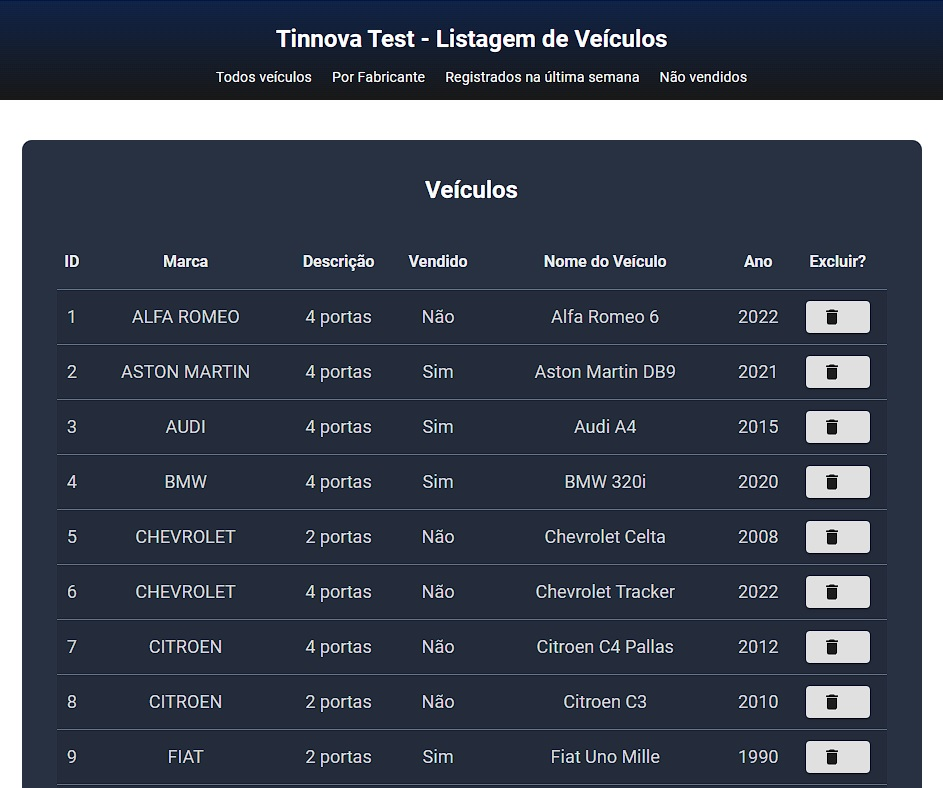
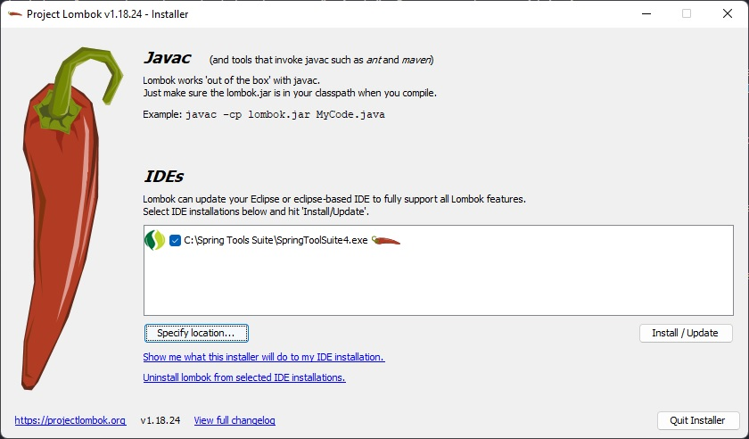
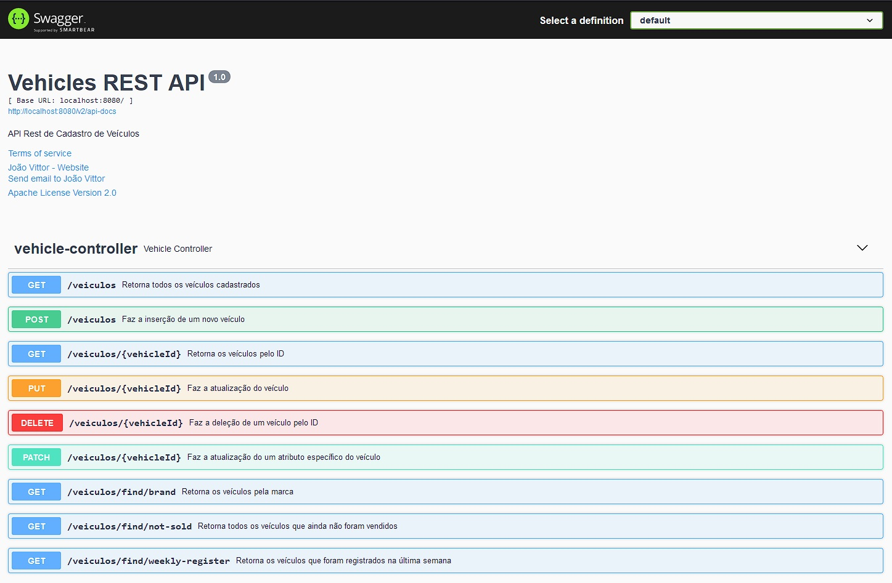

<h1 align="center">Desafio Tinnova - Dev Java Júnior</h1>

<p>O desafio consiste em 5 questões, nas quais 4 delas são voltadas à resolução de problemas matemáticos e 1 delas é focada na parte de criação de uma API e Frontend para consumo dessa API.</p>
<p>A aplicação conta com as questões em pastas separadas, sendo que as pastas de "task1" até "task4" são as de resolução de problemas matemáticos e as pastas "task5" contém a API e o Frontend, respectivamente.</p>
<p>A aplicação foi desenvolvida como parte de processo seletivo para a vaga de Dev Java Júnior.</p>

## ⚙️ Funcionalidades da Aplicação

<ul>
  <li>Cálculos matemáticos: cálculo de porcentagem de votos válidos, cálculo de fatorial e cálculo da soma de números múltiplos de 3 e 5 (dado certo número);</li>
  <li>Ordenação de um vetor desorganizado usando bubble sort;</li>
  <li>Criação e consumo de uma API de listagem de veículos, incluindo Frontend.</li>
</ul>

<br />

<p>Abaixo temos algumas screenshots da aplicação em execução: </p>



<br />


<br />


<br />


## 🔧 Instruções para executar a Aplicação localmente

<p>Primeiramente você precisa ter configurado e instalado na sua máquina o Java JDK 8 (ou OpenJDK), Maven, Node.js, PostgreSQL (e um gerenciador de banco de dados, como o pgAdmin 4), Spring Tool Suite e o VS Code.</p>
<p>Caso ainda não os tenha instalado, você pode fazer o download através dos links abaixo:</p>


* [OpenJDK 8](https://openjdk.org/projects/jdk8/)
* [Maven](https://maven.apache.org/download.cgi)
* [Node.js](https://nodejs.org/en/download/)
* [PostgreSQL](https://www.postgresql.org/download/)
* [Spring Tools Suite](https://spring.io/tools)
* [Visual Studio Code](https://code.visualstudio.com/download)

** Nota: Lembrando que para o Java e o Maven, você terá de fazer as configurações de variáveis de ambiente.

<br />

Após isso, podemos seguir para o clone e execução da Aplicação!

<br />

1° - Faça o clone do repositório a partir do seu terminal:
```bash
  git clone git@github.com:JVMMiguel/desafio_tinnova.git

```

<br />

2° - Abra o Spring Tool Suite e faça a importação (conforme imagem abaixo) das pastas com nome de "task", de 1 até 4, e também da pasta "task5-api": 


<br />

3º - Após importar todas as pastas, seu Spring Tool Suite ficará mais ou menos assim: 


<br />

4º - Para executar cada projeto, basta selecionar a atividade que quer executar e clicar com o botão direito e depois ir em "Run as > Spring Boot App". Para as atividades de 1 a 4, serão exibidos ou solicitados os dados da aplicação no console do Spring Tool Suite. Executando as aplicações: 


<br />

5º - Para a execução da tarefa 5, primeiramente você deve criar uma nova base de dados, usando linha de comando ou por um software gerenciador de banco de dados. O nome dessa base de dados deve ser "veiculo". Segue exemplo no pgAdmin 4: 


<br />

6º - Após a criação da base de dados, verificar o arquivo application.properties que se encontra na pasta "task5-api\src\main\resources" e alterar as configurações de usuário e senha do Postgres conforme configurados durante instalação na sua máquina. As linhas que devem ser alteradas são: 

```bash
  spring.datasource.url=jdbc:postgresql://localhost:5432/veiculo?currentSchema=public (aqui deve ser passado o local de instalação do seu banco de dados, entre as :// e a ?)
  spring.datasource.username=postgres (aqui deve ser passado o usuário do seu banco de dados)
  spring.datasource.password=postgres (aqui deve ser passado a senha do seu banco de dados)
```

<br />

7º - Feito isso, a aplicação "task5-api" pode ser iniciada corretamente. Caso ocorra algum problema durante a execução relacionado ao Lombok, o procedimento para correção será o seguinte: 

<ul>
  <li>Acesse a pasta do Maven (.m2) do seu computador. O caminho pode variar em cada Sistema Operacional, mas no caso do Windows ele fica em: C:\Users\SEU_USUÁRIO\.m2\repository\org\projectlombok\lombok\1.18.24 </li>
  <li>Execute o arquivo .jar usando o seguinte comando: </li>
</ul>

```bash
  java -jar lombok-1.18.24.jar
```

<ul>
  <li>Após executar o comando, ele irá abrir uma tela de configuração/atualização da sua IDE. Caso ele não encontre automaticamente a sua IDE, você pode clicar em "Specify location" e navegar até o executável da sua IDE e clicar em "Install/Update". Após selecionado, a tela deve ficar dessa forma: </li>
</ul>



<br />

8º - À partir daqui, com a API em funcionamento, você pode fazer os testes dos endpoints da API importando o arquivo "vehicles_endpoints.json", que se encontra na pasta de "docs_desafio" para o Insomnia ou acessar o endereço "http://localhost:8080/swagger-ui/index.html" para visualizar e testar através do Swagger. 



** Nota: a aplicação já conta com a integração do Flyway e na pasta task5-api\src\main\resources\db\migration temos um arquivo de nome V1__CREATE_VEHICLES.sql que já faz a inserção de alguns registros na tabela que foi criada, para haver registros e assim testar os endpoints.

<br />

9º - Após a API estar iniciada e funcional, podemos iniciar o Frontend da aplicação. Acesse a pasta com o repositório do projeto e faça a importação da pasta "task5-frontend" no VS Code. Após feito a importação do projeto abra um terminal do VS Code e execute o seguinte comando para baixar as dependências do Frontend: 

```bash
  yarn
```

<br />

10º - Terminado de baixar as dependências, podemos executar o projeto usando o comando abaixo e acessando o endereço da aplicação através de "http://localhost:5173/": 

```bash
  yarn dev
```


<p align="center">Desenvolvido por <a href="https://www.linkedin.com/in/joaovittormmiguel/">João Vittor</a></p>
